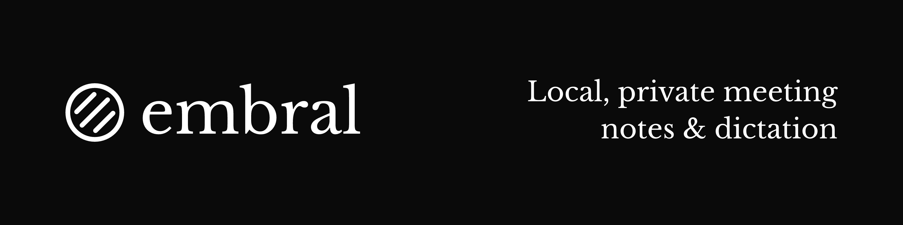
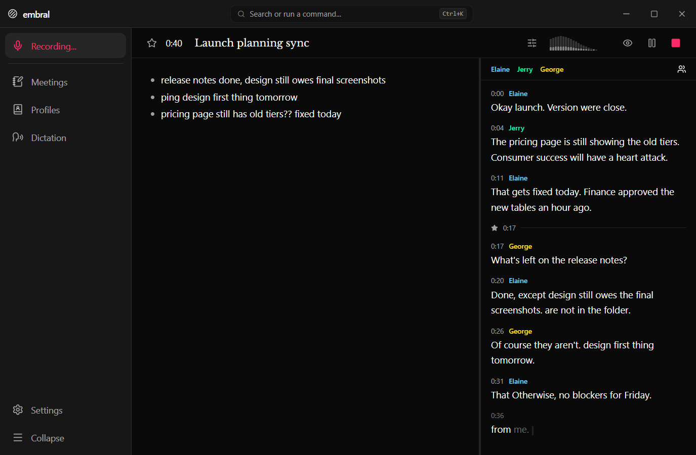
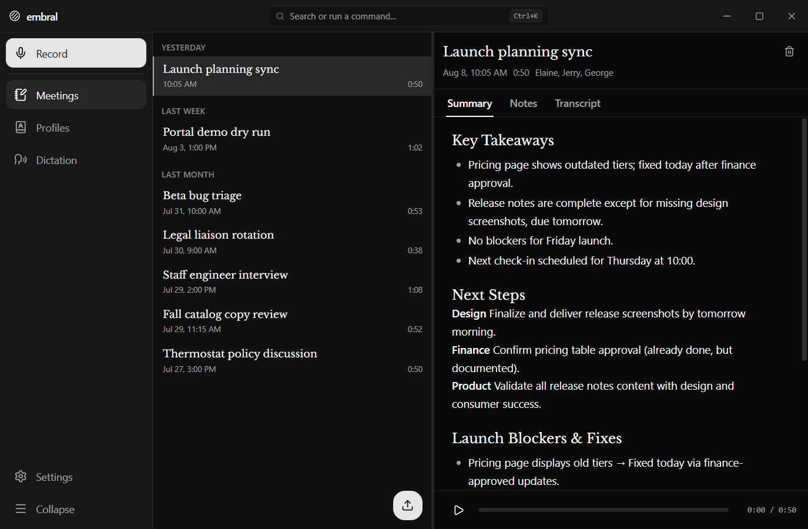
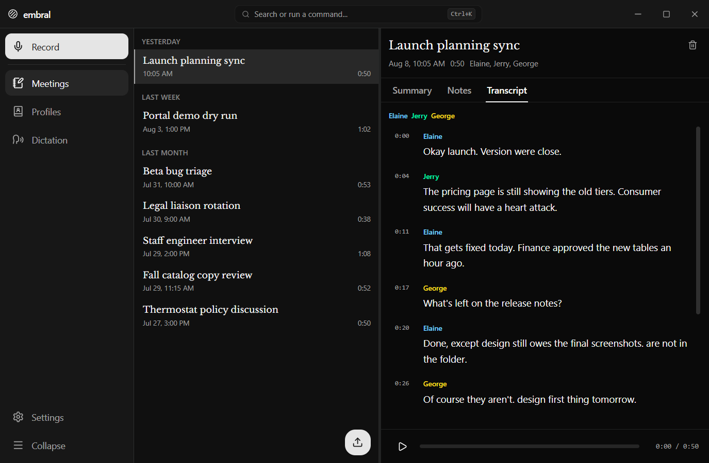
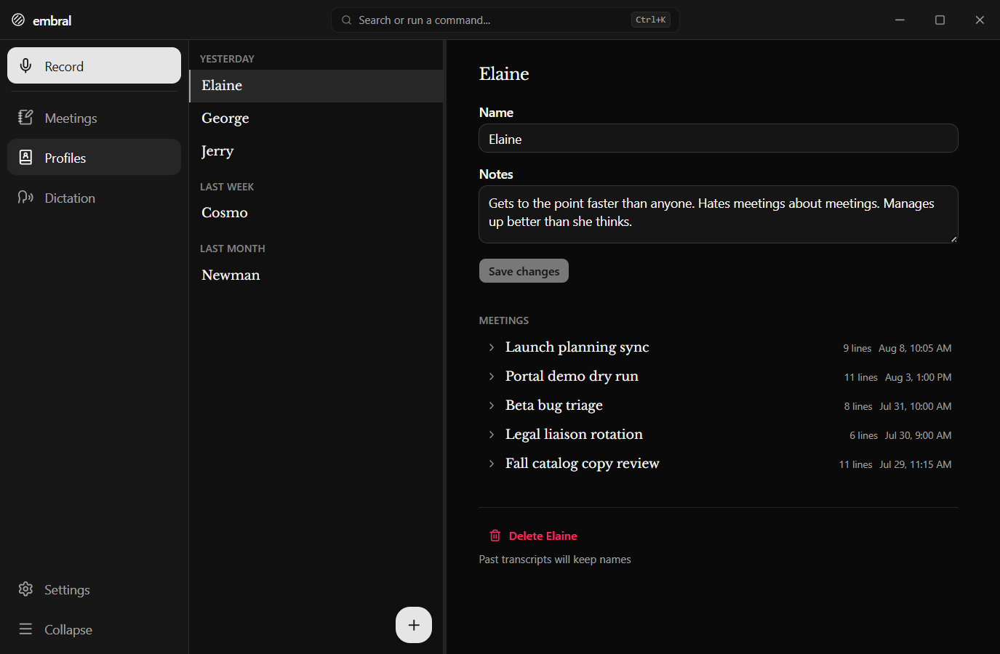
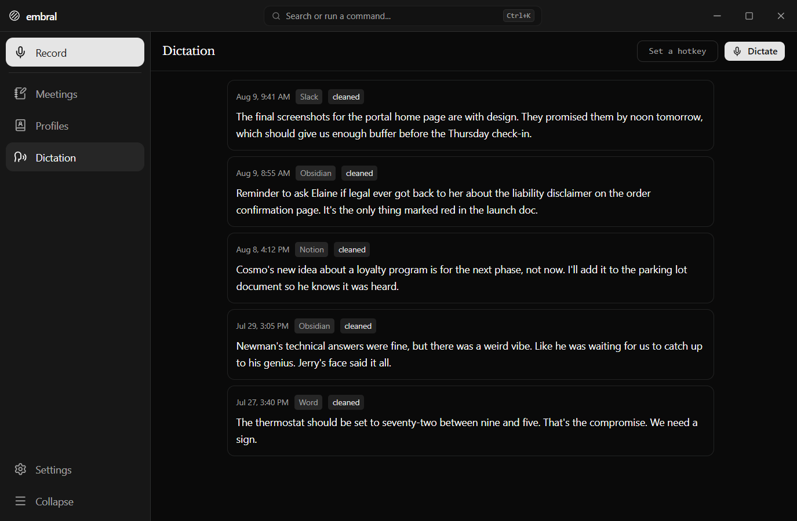
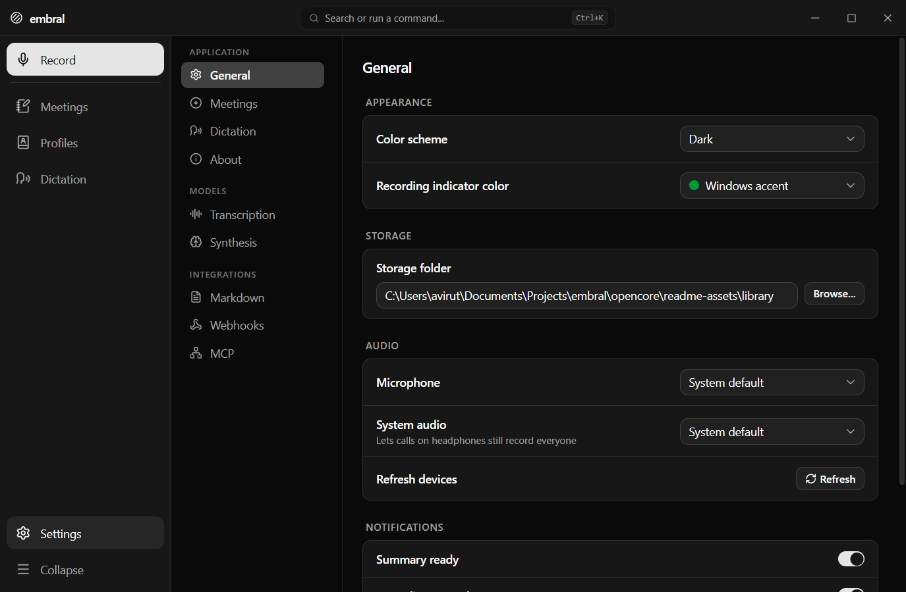
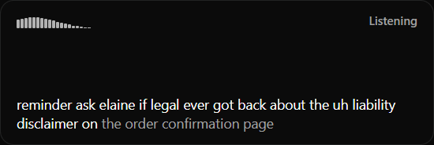

# embral

A desktop app for realtime transcription and voice dictation, designed for how you actually take and use notes.

Embral respects your privacy, and can be configured for use fully offline with no data egress.

Learn more & try out the demo on [embral.app](https://embral.app).

## Download and setup

Download the latest release for your platform: [Windows](https://github.com/embralapp/embral-core/releases/latest), [macOS](https://github.com/embralapp/embral-core/releases/latest), or [Linux](https://github.com/embralapp/embral-core/releases/latest).

In onboarding:
- Set up local models for transcription & summarization, or login to a cloud account for higher quality and more battery life
- Configure how you want to trigger meetings and dictation
- Connect to your AI tools (Claude, ChatGPT/Codex, or any other MCP client)
- Connect to your existing notes or workflows (Markdown export, webhooks)

Embral is designed to be highly configurable - explore the Settings tab to make it work better for you.

## Screenshots



https://github.com/user-attachments/assets/a4371557-6510-4220-a434-d395f38235c1

<details>
<summary>View more screenshots</summary>

| | |
|---|---|
|  *Meeting summary* |  *Transcript with speaker labels* |
|  *Speaker profiles* |  *Dictation history* |
|  *Settings* |  *The dictation overlay* |

</details>

## What you can do with embral

- Record & transcribe meetings with configurable audio sources, automatic call detection, and optional best-effort speaker labeling
- Type your own notes and paste in screenshots for later reference & use by integrations
- Generate structured meeting notes with an on-device (or cloud) language model
- Dictate into any app via global hotkey, with on-device or cloud AI cleanup
- Leverage workflow integrations so your notes actually save you time
  - Chat with your notes in any MCP client (Claude, ChatGPT/Codex, etc.)
  - Mirror your finished notes as Markdown (e.g., into an Obsidian vault)
  - Trigger post-meeting workflows via webhook

## This repository

This codebase is an **offline core** of embral, and can be built for a local-only version without any cloud capabilities or telemetry. The full app distributed via the [releases page](https://github.com/embralapp/embral-core/releases) adds optional paid cloud functionality (faster and more accurate transcription, cloud summaries).

Prerequisites:

- [Tauri prerequisites](https://tauri.app/start/prerequisites/)
- Rust
- Node.js 22+ and pnpm

### Building the offline-only version

```bash
pnpm install
pnpm tauri build
```

### Contributing to development

```bash
pnpm tauri dev
```

Feedback is highly appreciated and can be submitted using Issues in this repo.

## License

[MIT](./LICENSE)
